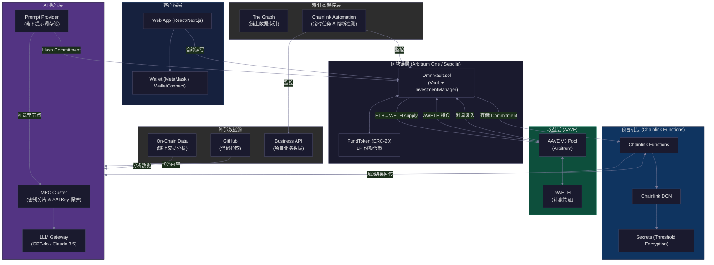
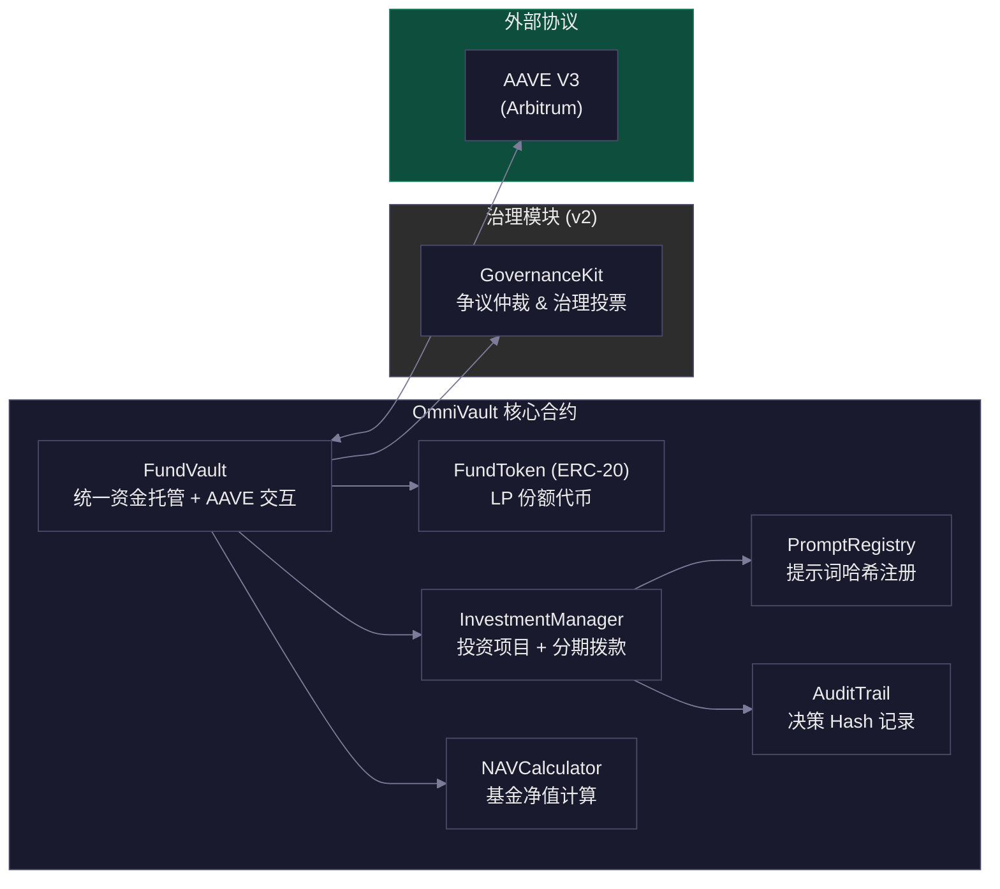
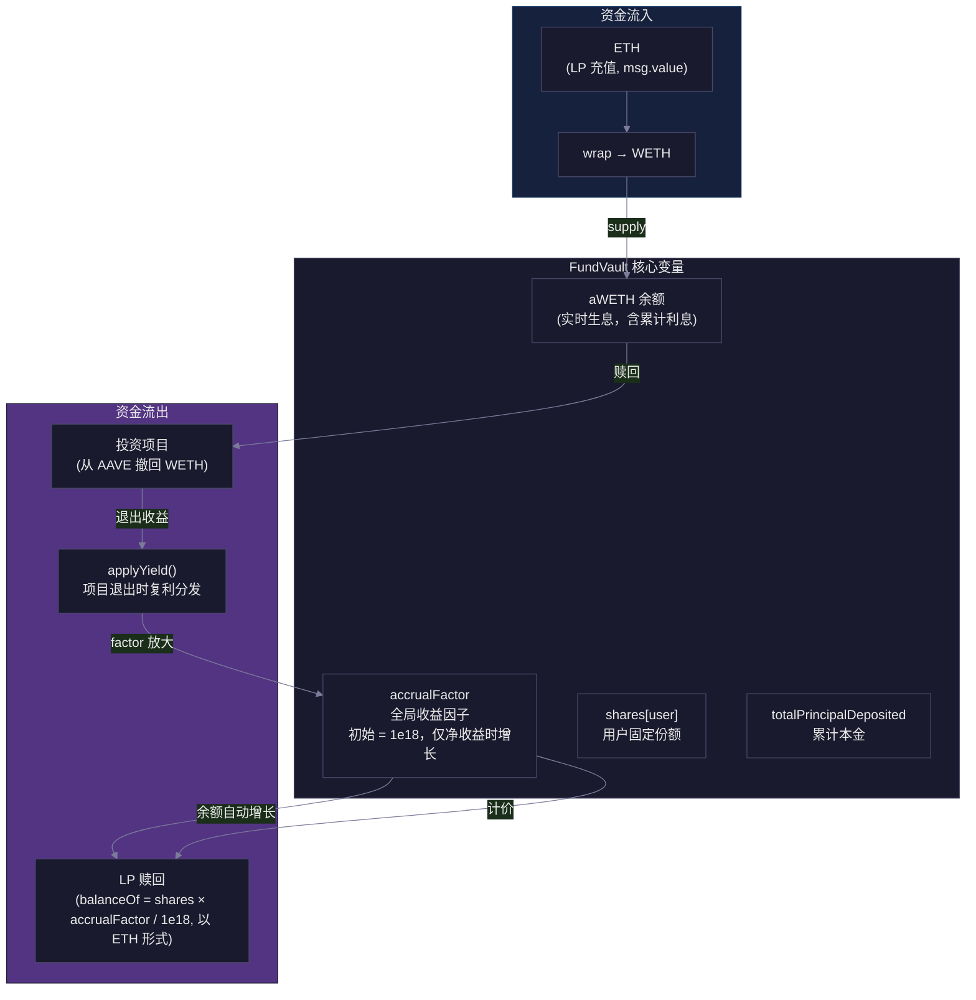
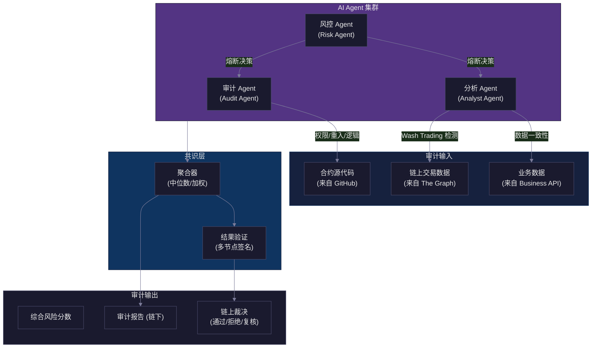
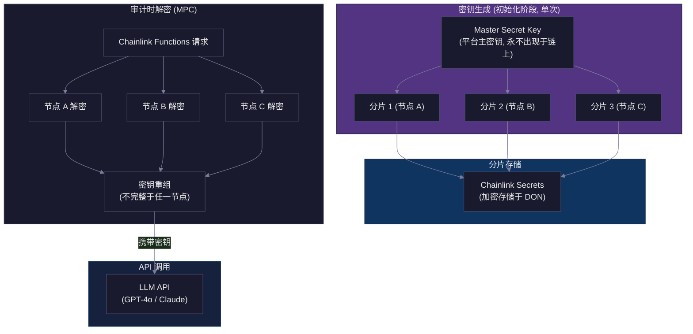
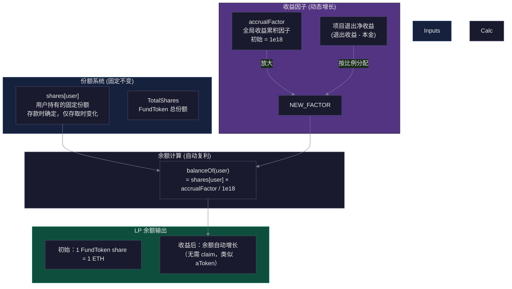

# OmniVault 技术架构图 v1.0

> 渲染说明：推荐使用支持 Mermaid 的 Markdown 编辑器（如 Typora、GitHub、Cursor 内置预览）查看完整图表。
> 基于 [PRD v1.0](./OmniVault_PRD_v1.md) 设计。

---

## 1. 系统整体架构



---

## 2. 核心流程时序图

### 2.1 LP 入金 → 项目审核 → 投资 → 赎回 完整流程

```mermaid
%%{init: {'theme': 'base', 'themeVariables': { 'primaryColor': '#1a1a2e', 'primaryTextColor': '#eaeaea', 'primaryBorderColor': '#4a4a6a', 'lineColor': '#7c7c9a'}}}%%
sequenceDiagram
    autonumber
    actor LP as LP 投资者
    actor VAULT as OmniVault FundVault
    actor AAVE as AAVE V3 Pool
    actor CLF as Chainlink Functions
    actor MPC as MPC Cluster
    actor LLM as LLM (GPT-4o/Claude)
    actor STARTUP as 创业团队

    rect rgb(20, 25, 45)
        Note over LP,AAVE: Phase 1: LP 入金 (无项目依赖)
        LP->>VAULT: deposit() payable (msg.value = ETH)
        VAULT->>VAULT: wrap ETH → WETH
        VAULT->>AAVE: supply(WETH)
        AAVE-->>VAULT: aWETH (计息凭证)
        VAULT-->>LP: FundToken (按 accrualFactor 铸造 shares)
        Note over VAULT: shares = msg.value × 1e18 / accrualFactor
    end

    rect rgb(25, 30, 50)
        Note over STARTUP,LLM: Phase 2: 项目申请 & AI 审计
        STARTUP->>VAULT: submitApplication(commitHash, contractAddr, bizApi)
        VAULT->>VAULT: 记录申请，质押代币转入合约
        VAULT->>CLF: sendRequest(auditRequest)
        CLF->>MPC: 获取 API Key 分片
        MPC-->>CLF: API Key 重组
        CLF->>LLM: executeAudit(code, promptSubset)
        LLM-->>CLF: riskScore 区间
        CLF->>VAULT: fulfillAudit(score, reportHash)
        Note over VAULT: score >= threshold → 通过
    end

    rect rgb(20, 30, 40)
        Note over VAULT,STARTUP: Phase 3: 自动投资放款
        VAULT->>AAVE: withdraw(WETH, amount)
        AAVE-->>VAULT: WETH
        VAULT->>VAULT: 记录 totalInvested += amount
        VAULT->>STARTUP: 首期释放 (20-30%, 以 ETH 形式)
        Note over STARTUP: 剩余部分按 vesting schedule 分期释放
        Note over VAULT,AAVE: 持续监控 (MONITOR 节点)
        alt 熔断触发
            MPC-->>VAULT: triggerCircuitBreak()
            VAULT->>VAULT: 暂停分期释放，Slash 质押
        end
    end

    rect rgb(15, 25, 40)
        Note over LP,AAVE: Phase 4: LP 赎回
        LP->>VAULT: redeem(shares)
        VAULT->>AAVE: withdraw(WETH, shares × accrualFactor / 1e18)
        AAVE-->>VAULT: WETH (含利息)
        VAULT->>VAULT: unwrap WETH → ETH
        VAULT->>LP: ETH (call{value: assets})
        VAULT->>LP: burn(FundToken shares)
    end
```



---

## 3. 合约模块架构



---

## 4. FundVault 资金流架构



---

## 5. AI Agent 集群协作架构



---

## 6. 密钥与 Secrets 管理架构



---

## 7. Rebasing Factor 模型



---

## 8. 技术选型汇总

| 层级 | 组件 | 技术选型 | 备注 |
|------|------|----------|------|
| **前端** | Web App | Next.js / React | AI Studio 风格 |
| **前端** | 钱包连接 | wagmi + viem | 支持 MetaMask / WalletConnect |
| **合约** | 开发语言 | Solidity ^0.8 | 使用 OpenZeppelin 5.x |
| **合约** | 升级方案 | UUPS Proxy | 允许合约升级 |
| **链** | 主网 | Arbitrum One | Layer 2 低 gas |
| **链** | 测试网 | Arbitrum Sepolia |  |
| **收益层** | 借贷协议 | AAVE V3 (Arbitrum) | 闲置资金自动存入生息 |
| **预言机** | 触发 AI | Chainlink Functions |  |
| **预言机** | 定时任务 | Chainlink Automation | 熔断检测 |
| **索引** | 链上数据 | The Graph | 交易分析 |
| **AI** | LLM | GPT-4o / Claude 3.5 | 多节点冗余 |
| **AI** | 密钥保护 | MPC (门限签名) | Chainlink Secrets |
| **存储** | 元数据 | IPFS / Arweave | (V2 规划) |
| **ZK** | 隐私保护 | (V2 规划) | zkSNARKs |

---

## 9. 目录结构（参考）

```
OmniVault/
├── contracts/
│   ├── vault/
│   │   ├── FundVault.sol         # 统一资金托管 + AAVE 交互
│   │   └── FundToken.sol         # Rebasing LP 份额代币
│   ├── investment/
│   │   ├── InvestmentManager.sol  # 投资项目 + 分期拨款
│   │   └── StreamingPayout.sol   # 分期释放算法
│   ├── registry/
│   │   ├── PromptRegistry.sol     # 提示词哈希注册
│   │   └── ApplicationRegistry.sol # 项目申请注册
│   ├── audit/
│   │   └── AuditTrail.sol        # 决策 Hash 记录
│   ├── governance/
│   │   └── GovernanceKit.sol     # (v2) 争议仲裁 & 治理
│   └── interfaces/
│       ├── IAiOracle.sol
│       ├── IFundVault.sol
│       └── IAavePool.sol
├── scripts/
│   ├── deploy.ts                  # 部署脚本
│   └── setup-aave.ts             # AAVE 配置
├── frontend/
│   ├── app/
│   │   ├── page.tsx              # 主页（基金仪表盘）
│   │   ├── apply/page.tsx        # 项目申请入口
│   │   └── lp/
│   │       ├── deposit.tsx       # LP 充值
│   │       └── redeem.tsx        # LP 赎回
│   └── components/
│       ├── FundDashboard.tsx      # 基金仪表盘
│       ├── AuditStatus.tsx       # 审计进度
│       └── YieldHistory.tsx       # 收益历史图
├── ai-agents/
│   ├── audit-agent/
│   │   ├── index.ts
│   │   └── prompts/
│   ├── analyst-agent/
│   └── risk-agent/
├── subgraph/
│   └── omni-vault-subgraph/
├── test/
│   ├── contracts/
│   └── integration/
└── docs/
    └── architecture/
```
