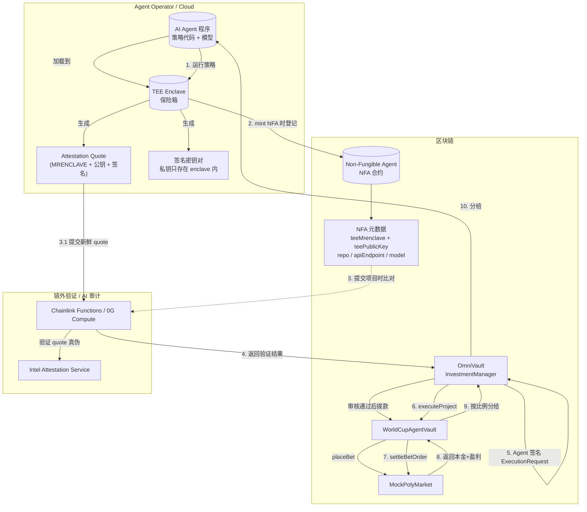

# NFA + TEE 运行流程图

## 关键角色

- **AI Agent**：运行预测/下注策略的程序。
- **TEE Enclave**：CPU 内部的隔离执行环境，保护策略代码和私钥。
- **NFA（Non-Fungible Agent）**：链上 Agent 身份 NFT，登记 enclave 的指纹（MRENCLAVE）和公钥。
- **OmniVault / InvestmentManager**：审核、拨款、执行签名的通用网关。
- **WorldCupAgentVault**：世界杯投注专用执行合约。
- **Chainlink Functions / 0G Compute**：验证 TEE attestation quote 并执行 AI 审计。

## 流程概览

## 步骤说明

1. **Agent 加载到 TEE**：Agent 运营商把策略代码加载进 CPU 的 enclave。
2. **Mint NFA**：链上 mint NFA，登记 `teeMrenclave`（enclave 指纹）和 `teePublicKey`（enclave 公钥）。
3. **提交项目**：Agent 调用 OmniVault `submitProject`，附带新鲜的 attestation quote。
4. **验证 attestation**：Chainlink Functions / 0G Compute 把 quote 交给 Intel Attestation Service 验证，确认 enclave 真实且代码未被篡改。
5. **签名执行请求**：Agent 对要执行的下注调用签名（EIP-712）。
6. **审核通过执行**：InvestmentManager 验证签名、拨款、调用 WorldCupAgentVault。
7. **下注到市场**：WorldCupAgentVault 调用 MockPolyMarket 执行 placeBet。
8. **比赛结束结算**：MockPolyMarket 返回本金 + 盈利。
9. **分账**：WorldCupAgentVault 按比例把收益分给 InvestmentManager 和 Agent。

## 核心安全点

- **策略保密**：策略代码跑在 enclave 内，外部无法读取。
- **防篡改**：attestation quote 证明 enclave 里跑的就是 NFA 登记的那份代码。
- **意图不可抵赖**：Agent 对每一次执行请求签名，资金只能按签名内容使用。
